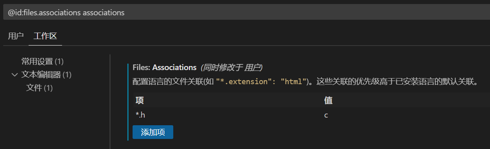

# 

## 1. VSCode中自定义的snippets对h文件无效的解决办法

VSCode把h文件当成C++语言了，所以在C语言中定义的snippets不起作用。

解决办法就是，手动将h文件指定为c语言。

在工作区/用户配置文件中增加以下配置内容：

```json
    "files.associations": {
        "*.h": "c"
    }
```




